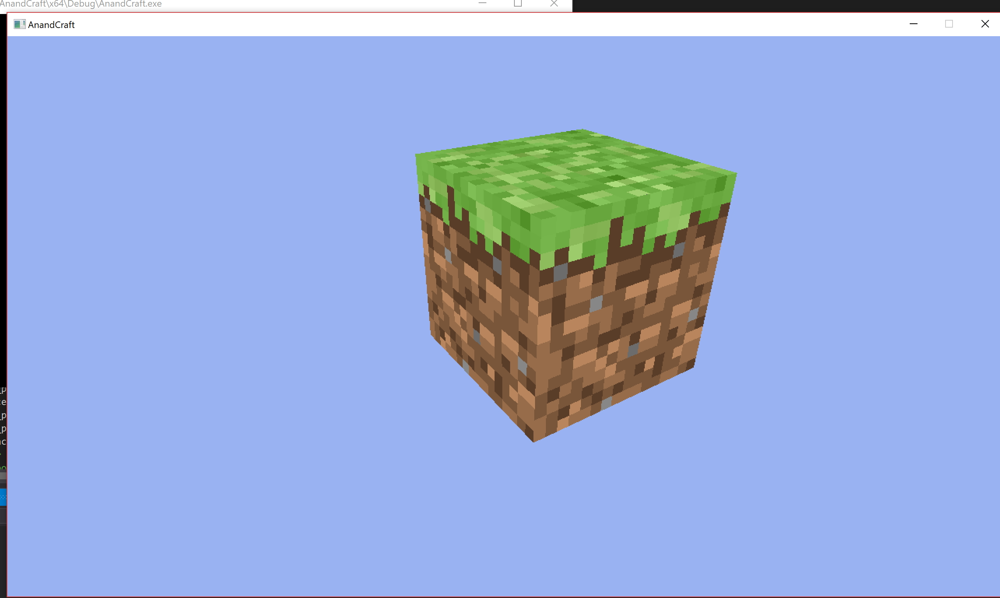
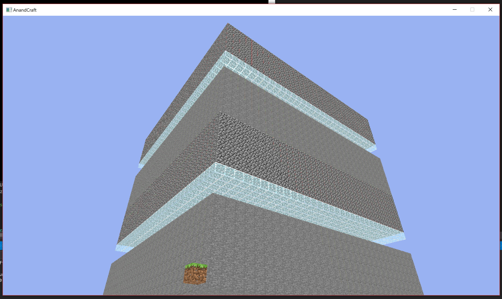
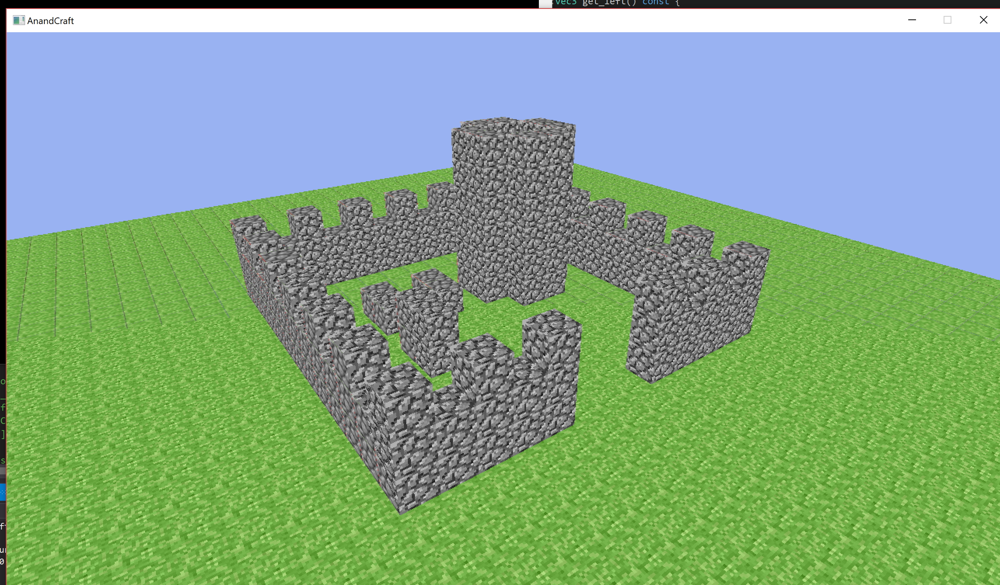

# AnandCraft
A Minecraft clone made by Anand Dukkipati

## Feature Todo List
- [x] blocks w/ textures
- [x] chunks
- [x] breaking and placing of blocks
- [x] saving and loading terrain from files
- [x] multi-threaded terrain (loading/saving, mesh building)
- [ ] generating terrain using noise
- [ ] frustum culling, remove faces between chunks, other optimizations
- [ ] collision detection
- [ ] lighting
- [ ] basic UI/Menu system (crosshair, block selection, world selection)

## Build on macOS
```
brew install cmake sdl2 glew glm
cmake .
make
./AnandCraft
```

## Screenshots:



